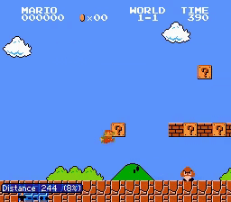
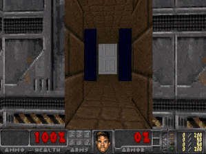

## Curiosity-driven Exploration by Self-supervised Prediction ##
#### In ICML 2017 [[Project Website]](http://pathak22.github.io/noreward-rl/) [[Demo Video]](http://pathak22.github.io/noreward-rl/index.html#demoVideo)

[Deepak Pathak](https://people.eecs.berkeley.edu/~pathak/), [Pulkit Agrawal](https://people.eecs.berkeley.edu/~pulkitag/), [Alexei A. Efros](https://people.eecs.berkeley.edu/~efros/), [Trevor Darrell](https://people.eecs.berkeley.edu/~trevor/)<br/>
University of California, Berkeley<br/>

    

This is a tensorflow based implementation for our [ICML 2017 paper on curiosity-driven exploration for reinforcement learning](http://pathak22.github.io/noreward-rl/). Idea is to train agent with intrinsic curiosity-based motivation (ICM) when external rewards from environment are sparse. Surprisingly, you can use ICM even when there are no rewards available from the environment, in which case, agent learns to explore only out of curiosity: 'RL without rewards'. If you find this work useful in your research, please cite:

    @inproceedings{pathakICMl17curiosity,
        Author = {Pathak, Deepak and Agrawal, Pulkit and
                  Efros, Alexei A. and Darrell, Trevor},
        Title = {Curiosity-driven Exploration by Self-supervised Prediction},
        Booktitle = {International Conference on Machine Learning ({ICML})},
        Year = {2017}
    }

### 1) Installation and Usage
1.  This code is based on [TensorFlow](https://www.tensorflow.org/). To install, run these commands:
  ```Shell
  # you might not need many of these, e.g., fceux is only for mario
  sudo apt-get install -y python-numpy python-dev cmake zlib1g-dev libjpeg-dev xvfb \
  libav-tools xorg-dev python-opengl libboost-all-dev libsdl2-dev swig python3-dev \
  python3-venv make golang libjpeg-turbo8-dev gcc wget unzip git fceux virtualenv \
  tmux

  # install the code
  git clone -b master --single-branch https://github.com/pathak22/noreward-rl.git
  cd noreward-rl/
  virtualenv curiosity
  source $PWD/curiosity/bin/activate
  pip install numpy
  pip install -r src/requirements.txt
  python curiosity/src/go-vncdriver/build.py

  # download models
  bash models/download_models.sh

  # setup customized doom environment
  cd doomFiles/
  # then follow commands in doomFiles/README.md
  ```

2. Running demo
  ```Shell
  cd noreward-rl/src/
  python demo.py --ckpt ../models/doom/doom_ICM
  python demo.py --env-id SuperMarioBros-1-1-v0 --ckpt ../models/mario/mario_ICM
  ```

3. Training code
  ```Shell
  cd noreward-rl/src/
  # For Doom: doom or doomSparse or doomVerySparse
  python train.py --default --env-id doom

  # For Mario, change src/constants.py as follows:
  # PREDICTION_BETA = 0.2
  # ENTROPY_BETA = 0.0005
  python train.py --default --env-id mario --noReward

  xvfb-run -s "-screen 0 1400x900x24" bash  # only for remote desktops
  # useful xvfb link: http://stackoverflow.com/a/30336424
  python inference.py --default --env-id doom --record
  ```

### 2) Other helpful pointers
- [Paper](https://pathak22.github.io/noreward-rl/resources/icml17.pdf)
- [Project Website](http://pathak22.github.io/noreward-rl/)
- [Demo Video](http://pathak22.github.io/noreward-rl/index.html#demoVideo)
- [Reddit Discussion](https://redd.it/6bc8ul)
- [Media Articles (New Scientist, MIT Tech Review and others)](http://pathak22.github.io/noreward-rl/index.html#media)

### 3) Acknowledgement
Vanilla A3C code is based on the open source implementation of [universe-starter-agent](https://github.com/openai/universe-starter-agent).
